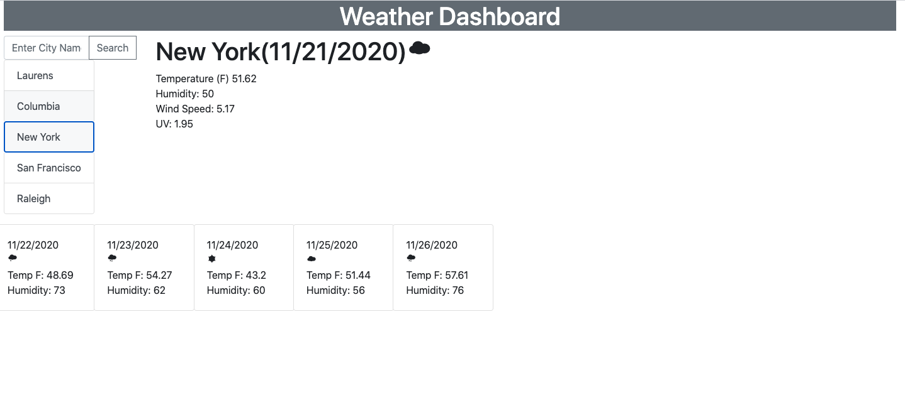

# Weather Dashboard
This project required the creation of a weather dash board that displayed the current weather for a city entered and also the 5 day forecast.  It stored the cities entered into local storage.  

## Enhancements 
Using jQuery, CSS, and HTML along with the Moment.js time library, the Owfonts library and the bootstrap CSS library, I was able to create an application that is dynamic as one enters the city desired.  API calls to  openweathermap.org API allowed for the retrieval of the desired data.  Temperature , Humidity, Wind Speed, and UV were displayed along with the dates of the current and forecasted weather.

## Usage
Wen viewing the page a smaple rendering of the main page is displayed below: 

## Contributing 
Pull requests are welcome. Feedback is appreciated.

## License
[MIT](LICENSE)